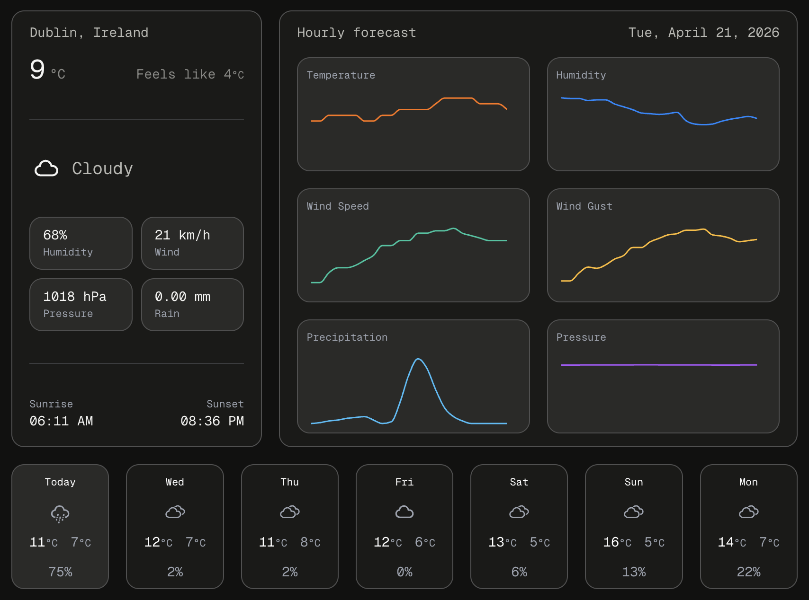

# Weather App

A minimal, location-aware weather app built with React and TypeScript. Displays real-time weather conditions, and a 7-day forecast with hourly condition graphs based on the user's device location, with a clean monospace aesthetic.

**Live demo:** [weather.smcmahon.dev](https://weather.smcmahon.dev)



## Features

- Automatic geolocation via browser API
- Real-time weather data including temperature, humidity, wind speed, gusts, surface pressure, and precipitation probability
- Hourly forecast data presented by graphs
- 7-day forecast overview, with hourly forecast graphs on selection
- Reverse geocoding to display the user's current location
- Dublin, Ireland as a default fallback when location data is unavailable

## Tech Stack

`TypeScript`. 
`React + Vite`. 
`Tailwind CSS`. 
`Open-Meteo API`. 
`Mapbox Geocoding API`. 
`AWS S3`. 
`AWS CloudFront`. 
`Cloudflare DNS`. 

## Getting Started

### Installation

```bash
git clone https://github.com/mcksb/weather-app.git
cd weather-app
npm install
```

### Environment Variables

```
VITE_MAPBOX_ACCESS_TOKEN=your_token_here
```

### Running Locally

```bash
npm run dev
```

## Notes

Open-Meteo is used for weather data and requires no API key. The Mapbox Geocoding API is used for reverse geocoding and requires a free account.

## Attribution

- Weather data by [Open-Meteo](https://open-meteo.com/) — CC BY 4.0
- Location data © [Mapbox](https://mapbox.com/)
- Weather icons by [Meteocons](https://meteocons.com/) — MIT License